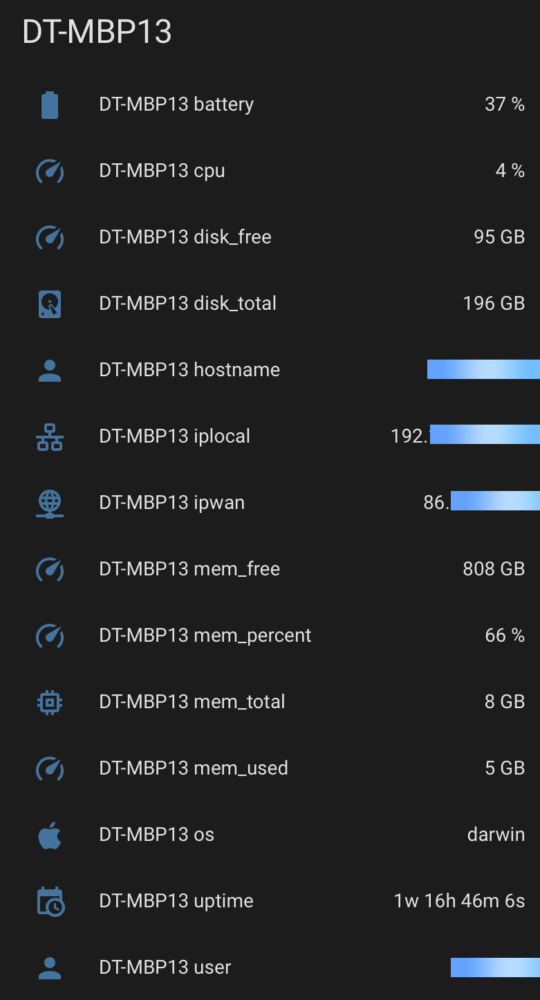
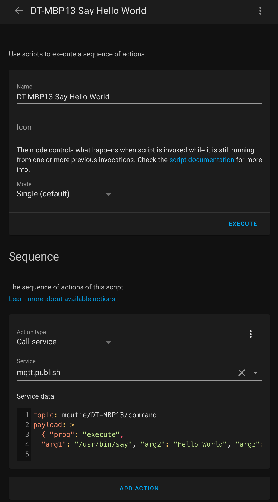

# MCutie

MCutie is a cross platform agent that publishes device metrics to your MQTT broker. It can also receive published commands to execute locally.

I've (lightly) tested it on macOS Big Sur and Windows 10 (x64) , it complies fine for Linux  but I've not had a chance to test it  yet.

Whilst it works fine for me, this should be considered <u>**Alpha**</u> software because:

- I'm a rookie coder! Golang is my first experience at coding in a 'proper' language

- I've not read up on how to test code yet!

- I basically use StackExchange to solve all of my problems :-)

## Motivation

I developed this agent specifically so that the computers in my local network could publish stats that show up in the HomeAssistant Dashboard:



You can also execute commands from Home Assistant using the Scripts module like this:



## Installation

Clone the repository or download the ZIP file somewhere.

Rename `config.yaml.sample` to `config.yaml`

Edit `config.yaml` with your MQTT broker settings

```yaml
url: ssl://ha.yourdomain.com:8883
username: mqttuser
password: Your-Passowrd
updateinterval: "9"
```

Update internal is how frequently you want the agent to publish your computer stats to the MQTT server. I guess in a larger network you might want to increate this to 60 seconds or more to prevent load on your MQTT broker.

### MacOS

I've writen a Bash script to install MCutie as a local user service:

```bash
chmod +x osx-install.sh

./osx-install.sh -i

To un-install:

./osx-install.sh -u

```

It will now run at boot and continually attempt to re-start itself after 60 seconds after failure , e.g. you disconnect from your network or your MQTT broker goes offline.

### Windows

The program runs and works as expected but I've not decided how best to run it as a user land service yet.

## Debugging
MCutie outputs to a log file located in the same folder as the executable file e.g. on MacOS
```bash
cat ~/.mcutie/mcutie.log

time="2020-12-23T23:38:23Z" level=info msg="***"
time="2020-12-23T23:38:23Z" level=info msg="*** Start program execution ***"
time="2020-12-23T23:38:23Z" level=info msg="***"
time="2020-12-23T23:38:23Z" level=info msg="Cleaning up hostname to remove suffix (if present)"
time="2020-12-23T23:38:23Z" level=info msg="Safe hostname = DT-MBP13"
time="2020-12-23T23:38:23Z" level=info msg="read data from config.yaml"
time="2020-12-23T23:38:23Z" level=info msg="Connect to MQQT server"
time="2020-12-23T23:38:24Z" level=info msg="Subscribe to 'command' topic"
time="2020-12-23T23:38:24Z" level=info msg="Connected to MQTT server"
time="2020-12-23T23:38:24Z" level=info msg="Subscribed to topic: mcutie/DT-MBP13/command"
time="2020-12-23T23:38:24Z" level=info msg="Publish HA auto-config sensors"
time="2020-12-23T23:38:24Z" level=info msg="Fuction: publishHomeAssistantAutoConfigData hostNameSafe = DT-MBP13"
time="2020-12-23T23:38:24Z" level=info msg="Fuction: publishHomeAssistantAutoConfigData hostNameSafe = DT-MBP13"
time="2020-12-23T23:38:24Z" level=info msg="Fuction: publishHomeAssistantAutoConfigData hostNameSafe = DT-MBP13"
time="2020-12-23T23:38:24Z" level=info msg="Fuction: publishHomeAssistantAutoConfigData hostNameSafe = DT-MBP13"
time="2020-12-23T23:38:24Z" level=info msg="Fuction: publishHomeAssistantAutoConfigData hostNameSafe = DT-MBP13"
time="2020-12-23T23:38:24Z" level=info msg="Fuction: publishHomeAssistantAutoConfigData hostNameSafe = DT-MBP13"
time="2020-12-23T23:38:24Z" level=info msg="Fuction: publishHomeAssistantAutoConfigData hostNameSafe = DT-MBP13"
time="2020-12-23T23:38:24Z" level=info msg="Fuction: publishHomeAssistantAutoConfigData hostNameSafe = DT-MBP13"
time="2020-12-23T23:38:24Z" level=info msg="Fuction: publishHomeAssistantAutoConfigData hostNameSafe = DT-MBP13"
time="2020-12-23T23:38:24Z" level=info msg="Fuction: publishHomeAssistantAutoConfigData hostNameSafe = DT-MBP13"
time="2020-12-23T23:38:24Z" level=info msg="Fuction: publishHomeAssistantAutoConfigData hostNameSafe = DT-MBP13"
time="2020-12-23T23:38:24Z" level=info msg="Fuction: publishHomeAssistantAutoConfigData hostNameSafe = DT-MBP13"
time="2020-12-23T23:38:24Z" level=info msg="Fuction: publishHomeAssistantAutoConfigData hostNameSafe = DT-MBP13"
time="2020-12-23T23:38:24Z" level=info msg="Fuction: publishHomeAssistantAutoConfigData hostNameSafe = DT-MBP13"
time="2020-12-23T23:38:24Z" level=info msg="Fuction: publishHomeAssistantAutoConfigData hostNameSafe = DT-MBP13"
time="2020-12-23T23:38:24Z" level=info msg="Publish device stats in a loop"
```

## Notes

1. Did I mention this is alpha software under active development from a rookie coder? 

2. I decided early on that I didn't want MCutie to run as root, it's a big security burden that I didn't want to be responsible for and 99% of what I wanted to achieve can be done running in user space.

### Credits

stackexchange.com

github.com/shirou/gopsutil

github.com/sirupsen/logrus

github.com/eclipse/paho.mqtt.golang

github.com/zpatrick/go-config

github.com/deckarep/gosx-notifier